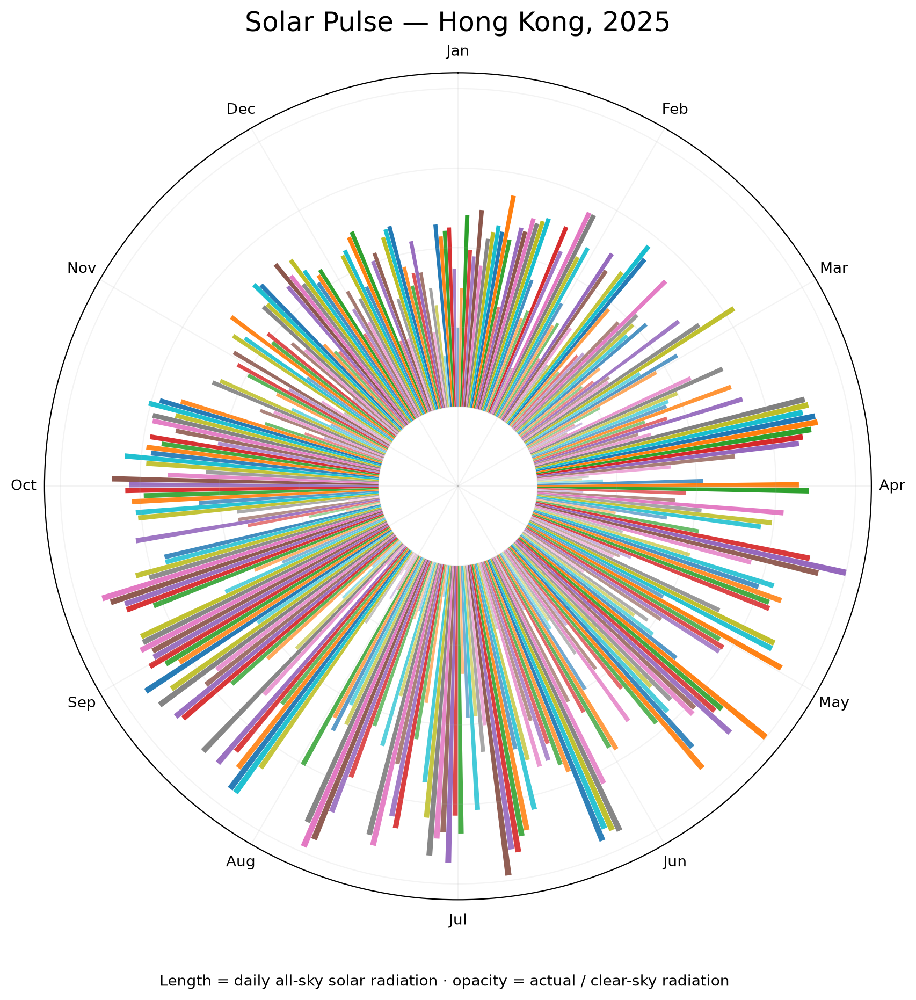

# Solar Pulse: Hong Kong, 2025



## The phenomenon

The amount of sunlight reaching the ground changes from day to day. Clouds and other atmospheric conditions can reduce the solar energy measured at the surface, even when the Sun is higher in the sky. I chose one year in Hong Kong to make these daily changes visible across a complete calendar. The chart is a compact view of the changing solar resource, not a record of sunshine hours or a measurement from a rooftop instrument.

## The source

The data comes from the NASA POWER daily point API for Hong Kong, at approximately 22.3193 N, 114.1694 E. The local JSON file contains 365 daily records for 2025. Each date has two values: `ALLSKY_SFC_SW_DWN`, the all-sky surface shortwave radiation, and `CLRSKY_SFC_SW_DWN`, its clear-sky counterpart. The daily radiation values are reported in kWh/m2/day. The source is [NASA POWER](https://power.larc.nasa.gov/), and the request uses its [daily point API](https://power.larc.nasa.gov/api/temporal/daily/point).

## What the picture shows

Each bar represents one day, arranged around the circle in calendar order. Bar length is scaled against the largest actual daily value in this year, while opacity compares actual radiation with the clear-sky value. This makes the seasonal rhythm and cloudy or low-radiation days easy to scan. The normalization means bar lengths show relative values rather than the original units; opacity is also capped, so ratios above one are not distinguished. The chart does not show hourly changes or explain the cause of each daily fluctuation.

## Run it

```
uv run fetch.py
uv run plot.py
```
