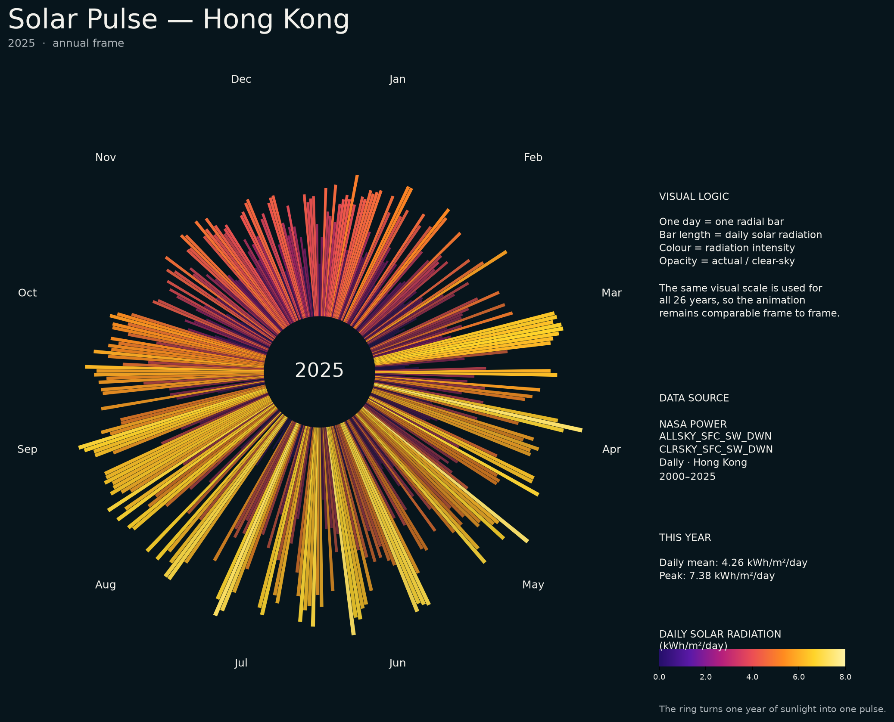

# Solar Pulse — Hong Kong, 2000–2025



Above: 2025, as a poster. The chart is also an animation — the same circle of daily bars, morphing year by year from 2000 to 2025 — playing live at <https://serena-3333.github.io/SD5913-Solar-Pulse/>, a page GitHub rebuilds from the committed files on every push. The full-resolution GIF is committed as `out/solar_pulse_2000_2025.gif`.

## The phenomenon

The sunlight reaching the ground in Hong Kong runs on two clocks. Through the year it follows the Sun: long, bright days in summer, short dim ones around the winter solstice. Against that rhythm, cloud and haze punch holes — a June day can measure less radiation than a clear January one. I looked at it because one year of daily values reads naturally as a single shape, a circle, and because morphing twenty-six of those years into one another, under one unchanging scale, makes the second clock visible: how unlike itself the same calendar day can be from one year to the next.

## The source

The numbers come from the [NASA POWER](https://power.larc.nasa.gov/) [daily point API](https://power.larc.nasa.gov/api/temporal/daily/point), for the point 22.3193 N, 114.1694 E — Hong Kong. `fetch.py` called it once and committed the raw reply, unchanged, as `data/solar_pulse_2000_2025_raw.json`: 9,497 rows, one per day from 1 January 2000 to 31 December 2025. Each row holds two values in kWh/m²/day — `ALLSKY_SFC_SW_DWN`, the all-sky surface shortwave radiation that actually reached the ground, and `CLRSKY_SFC_SW_DWN`, its clear-sky counterpart. Every other script reads that committed file and runs with the wifi off.

## What the picture shows

Each bar is one day, fixed at its own angle in calendar order. Length and colour follow that day's radiation on one scale — 0 to 8 kWh/m²/day — shared by all twenty-six years, with a legend that never moves, so a change on screen is a change in the data and not a re-scaled axis. Opacity carries the second number: it compares the actual value with the clear-sky one, so an overcast day reads as a hole in the ring even when its bar is long. In the animation each year grows out of the previous one at the same angles, day by day. What the picture throws away: hours — only daily totals survive; 29 February — the animation pins every date to a fixed 365-slot circle, so leap years never shift the angles; and the extremes of the ratio — opacity is floored and capped, so the dimmest day stays visible while days brighter than the clear-sky model look the same. The glow around the brightest bars is decoration, not data.

## Run it

```
uv run fetch.py
uv run plot.py
uv run animate.py
uv run site.py
```

| Command | Output | Description |
|---|---|---|
| `uv run fetch.py` | `data/solar_pulse_2000_2025_raw.json` | Calls the NASA POWER daily API once and stops. One row per day — 9,497 days from 2000 to 2025, each holding the all-sky and clear-sky radiation in kWh/m²/day, committed unchanged. |
| `uv run plot.py` | `out/solar_pulse_2025.png` | Draws 2025 alone — the same polar chart as the animation's last frame — as the still poster at the top of this README. |
| `uv run animate.py` | `out/solar_pulse_2000_2025.gif` | Renders all 326 frames in parallel across the CPU cores — one 0.3 s hold per year, twelve 40 ms morph steps between each pair of adjacent years — then Pillow assembles them into the looping GIF, about 8 seconds on an M-series Mac. The per-frame files it drops in `out/frames/` are intermediates. |
| `uv run site.py` | `site/index.html`, `solar_pulse_2000_2025.webp` | Squeezes the committed GIF into a lighter animated WebP — 1200 px wide, quality 75, about 18.7 MB, a third of the GIF's weight — files it under `out/`, then copies it next to `site/index.html`, the one-page site that plays it full-viewport. GitHub Actions runs this same command to publish the page. |
